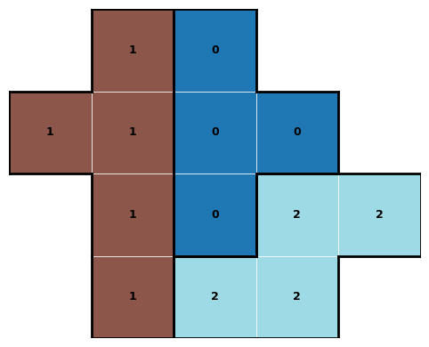
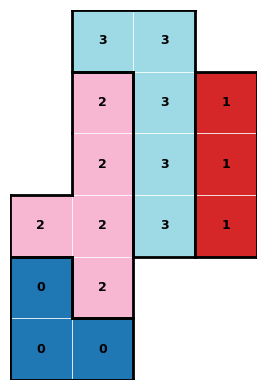

# 🧩 UbongoSolve

A Python solver for [Ubongo](https://en.wikipedia.org/wiki/Ubongo)-style tile-placement puzzles using constraint programming ([OR-Tools CP-SAT](https://developers.google.com/optimization/cp/cp_solver)).

Given a set of polyomino pieces and a board, UbongoSolver finds a placement that tiles the board exactly — no gaps, no overlaps.

## Features

- **Automatic piece orientation**: handles all rotations (0°/90°/180°/270°) and flips
- **Constraint programming engine**: powered by Google OR-Tools CP-SAT for fast, exact solving
- **Visualization**: text-based and matplotlib-based solution display with colored pieces and piece-boundary outlines
- **Built-in puzzles**: includes the [White Chocolate puzzle](https://store.hanayamatoys.co.jp/items/58611532) with a few board variants


 

## Installation

Requires Python 3.10+.

```bash
pip install ubongosolve
```

### From source

```bash
git clone https://github.com/kota7/ubongosolve.git
cd ubongosolve
pip install -U .
```

## Quick Start

```python
from ubongosolve import Piece, Board, UbongoPuzzle

# Define pieces as sets of (x, y) coordinates
pieces = [
    Piece([(0,0), (0,1), (0,2), (0,3), (1,3)]), # L-shape
    Piece([(0,0), (1,0), (1,1), (2,1)]),        # S-shape
    Piece([(0,0), (0,1), (1,1)]),               # mini L-shape
]

# Define a board
board = Board([(x, y) for x in range(4) for y in range(3)])

# Solve
solver = UbongoPuzzle(pieces, board)
status = solver.solve()
print(status)  # "OPTIMAL" or "FEASIBLE"

# View the solution
solver.print_solution()     # text output
solver.plot_solution()      # matplotlib figure
```


### Example: Ubongo Sample problem

```python
from ubongosolve import UbongoPuzzle, ubongo

problem = ubongo.sample_problems[0]  # Two problems are included
solver = UbongoPuzzle(problem["pieces"], problem["board"])
solver.solve()
solver.plot_solution()
```

### Example: White Chocolate puzzle

```python
from ubongosolve import UbongoPuzzle, whitechocolate

# Solve the basic 5×8 board
solver = UbongoPuzzle(whitechocolate.pieces, whitechocolate.board)
solver.solve()
solver.plot_solution()

# Try a challenge board
solver = UbongoPuzzle(whitechocolate.pieces, whitechocolate.boards["challenge_6"])
solver.solve()
solver.plot_solution()
```

## API Reference

### `Piece(coordinates)`

A polyomino piece defined by a set of `(x, y)` cell coordinates. Coordinates are automatically normalized so the minimum x and y are zero.

### `Board(coordinates)`

A board defined by a set of `(x, y)` cell coordinates. Can be any shape — rectangles, L-shapes, boards with holes, split boards, etc.

### `UbongoPuzzle(pieces, board)`

| Method / Property | Description |
|---|---|
| `solve(timeout=100)` | Solve the puzzle. Returns status string (`"OPTIMAL"`, `"FEASIBLE"`, `"INFEASIBLE"`, ...) |
| `solution` | `dict[tuple[int,int], int]` mapping each cell to its piece ID |
| `print_solution()` | Print an ASCII representation |
| `plot_solution()` | Display a matplotlib figure with colored pieces |
| `solution_as_fig` | Returns `(fig, ax)` without displaying |

## How It Works

1. **Piece expansion**: each piece is expanded into all distinct orientations (up to 8: 4 rotations × 2 flips).
2. **Origin candidates**: for each orientation, all valid placements on the board are precomputed.
3. **CP-SAT model**: boolean variables represent "piece *i* in orientation *o* is placed at origin *(x, y)*". Constraints enforce:
   - Each piece is placed exactly once (one orientation + origin selected).
   - Each board cell is covered by exactly one piece.
4. **Solve**: OR-Tools CP-SAT finds a feasible assignment or proves infeasibility.

## License

MIT
